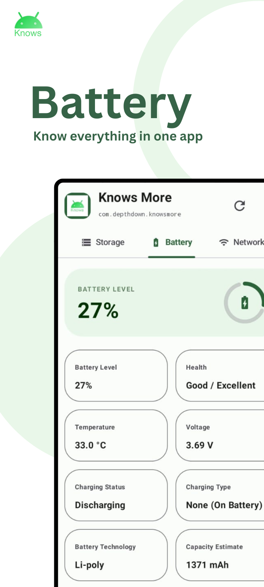
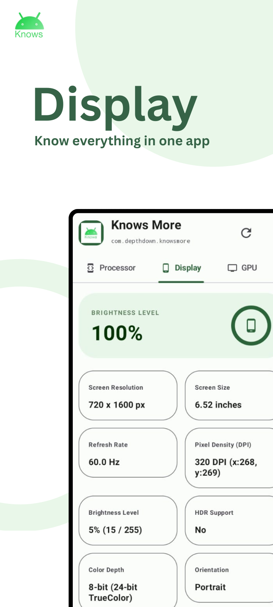
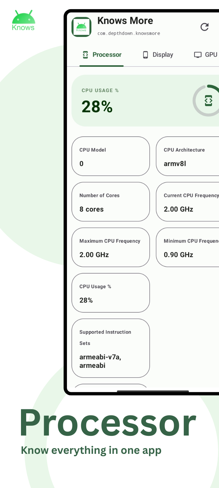

# knows More
<h3>Download Knows More app for android</h3>
<h3>Knows More is a powerful and intuitive device information application designed to help you explore, analyze, and understand every aspect of your Android smartphone. Whether you're curious about your phone's technical specifications, troubleshooting an issue, comparing devices, or simply interested in learning more about the hardware and software that power your device, Knows More puts detailed information right at your fingertips through a clean, organized, and easy-to-use interface.

The app gathers and presents comprehensive insights about your device in real time, giving you a complete overview of its performance and capabilities. From processor details and memory usage to battery health and sensor availability, Knows More makes complex system information accessible to everyone.

### Features

• **Detailed Device Specifications** – View a complete profile of your smartphone, including manufacturer, model, device code name, and other essential hardware details.

• **Processor and CPU Information** – Explore in-depth processor data such as CPU architecture, core count, clock speeds, supported instruction sets, and current processor status.

• **RAM and Storage Details** – Monitor total and available RAM, internal storage capacity, used space, and remaining storage to better manage your device resources.

• **Display and Screen Information** – Check screen resolution, pixel density, refresh rate (where supported), display size, orientation, and other display characteristics.

• **Android Version and System Details** – Access information about your Android version, API level, security patch level, build number, kernel version, and operating system environment.

• **Battery Status and Health Information** – Stay informed about battery level, charging status, temperature, voltage, battery technology, and overall battery condition to help maintain optimal performance.

• **Network and Connectivity Information** – View details about Wi-Fi connections, mobile networks, IP addresses, Bluetooth status, SIM information, and other connectivity features.

• **Sensor Detection and Availability** – Discover which sensors are available on your device, including accelerometer, gyroscope, proximity sensor, light sensor, magnetometer, and more.

• **Camera Information** – Explore camera specifications such as available cameras, supported features, resolutions, and hardware capabilities.

• **Real-Time Device Statistics** – Monitor live system information and dynamic device metrics to understand how your smartphone performs during everyday use.

• **Simple and User-Friendly Design** – Navigate effortlessly through clearly organized sections designed to make technical information easy to understand for users of all experience levels.

Whether you're a **technology enthusiast** who enjoys exploring device capabilities, a **developer** who needs accurate hardware and system information for testing and optimization, or an **everyday user** looking to better understand the smartphone you rely on every day, **Knows More** provides the insights you need to make informed decisions and get the most out of your Android device.

Discover what your device is truly capable of with **Knows More**—your complete companion for understanding Android from the inside out.
</h3>
<h2>Screenshot</h2>
 
 

  
  
  
  

